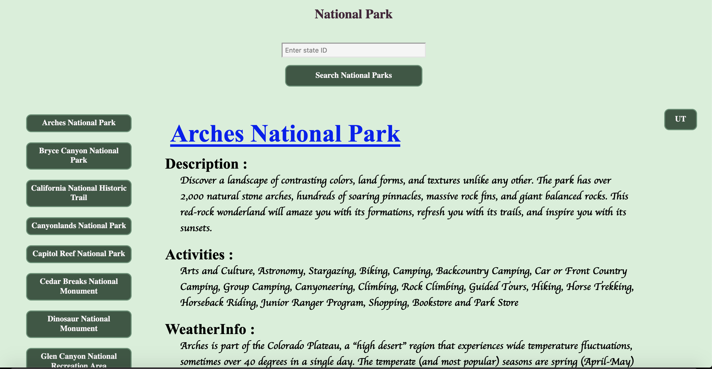

# Team-Shrek
 
##URL

The URL of the deployed application : https://shruthisalimath.github.io/Team-Shrek/

##  National Park search with current day Weather Check

## User Story
As a nature enthusiast,
I want to use an application that allows me to track the locations and weather conditions of national parks, so that I can plan my trips and enjoy the outdoors. 

## Acceptance criteria
 Given an application with the input form,
 1. When I search for national parks using state Id,
   THEN I am presented with List of the national parks in that state and those list should have buttons.
 2. When I give the search input by state Id,
   Then the state Id is displayed on page with buttons and also Search element is saved in the local storage.
 3. When I click on the particular national park,
     Then I am presented with the National park name,Description about it, acticities in that national park ,weather information as well as current date weather .
 4. When I click  on the  name of the national park in the information container link.
    Then it should be taken to new window with deployed application of national park information .This page  is fetched from serverside API that we have used.
 5. Current weather information is fetched from another serverside API.
 7. When we click on the state ID button, the search input.
  Then again it displayes List of the national parks in that state.
 8. Whenever  we click on the national park button ,
  Then the name of the national park is stored in the local storage.
 9. When the weather information is displayed.
   Then along with the weather information like temperature,wind and feels like. it should also have the current date and city name of the national park. 
 10. WHEN I resize the page or view the site on various screens and devices
  THEN I am presented with a responsive layout that adapts to my viewport.

  ## Screen Shot
  

  ## Discription of the Project: National park search with current day weather check

  1. Aim:
     1. Search the national parks that exists in the particular state .
     2. Information and description about the national park.
     3. Activities to do in the national parks.
     4. Current day weather information of the city of the national park. 

  2. Technologies used:
     1. HTML,
     2. CSS, 
     3. CSS framework - Bulma,
     4. JavaScript,
     5. Jquery.
  
 3. Server side API Used:
     1.  NationalPark API : https://www.nps.gov/subjects/digital/nps-data-api.htm
     2. Weather API : https://openweathermap.org/

 4. Project Objectives:
    1. created a real-world front-end application.
    2. Used a CSS framework - BULMA .
    3. Deployed to Github pages.
    4. Its interactive (i.e., accept and respond to user input).
    5. Used  two server-side APIs.
    6. Used modals instead of alerts, confirms and prompts.
    7. Used client-side storage to store persistant data.
    8. page is Responsive .
    9. Polished UI.

 5. Link to the deployed Application :
      https://shruthisalimath.github.io/Team-Shrek/

   

